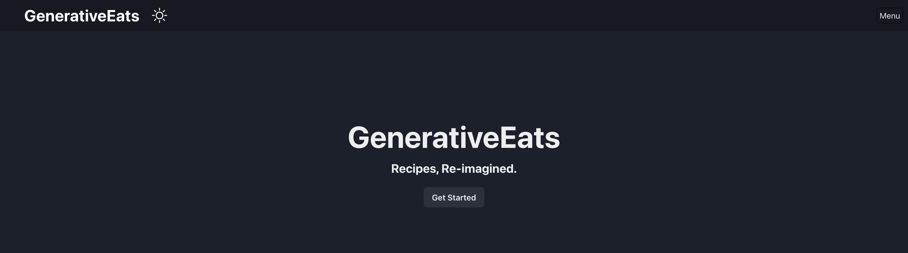
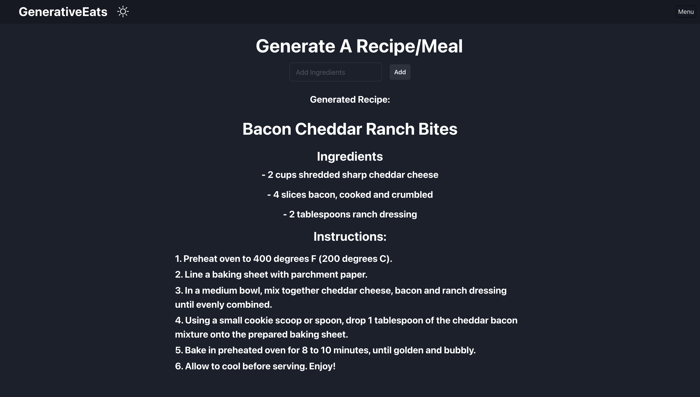
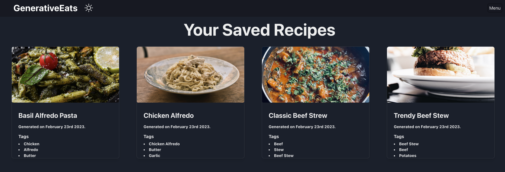

# Generative Eats - Submission for Refine Hackathon


### Cover Image



## About

### Description

My submission is a generative AI recipe/meal web application using refine chakra-ui, express.js, react, openAI, mongoDB, redux and more!

This app takes the problem of cooking a daily meal and flips it upside down! With GenerativeEats, you can give the web app a list of ingredients and it will generate recipes for you. 

You can also save these generated recipes to mongoDB, allowing users to come back daily and use the generated recipes as a reference.

### Participants

In this section, add the GitHub and Twitter profiles of everyone in your team.

I worked alone on this project. My Github: [Here](https://github.com/nyumat)

### Preview




### Set up Project


### Prerequisites

- MongoDB Cluster
- Unsplash Access Key


### Install Project

```
cd refine-wi-hack
```

```
npm i && run dev
```

```
cd backend
```

```
npm i && npm run dev
```

For example:

- Clone the repository:
```
git clone https://github.com/Nyumat/GenerativeEats.git
```
